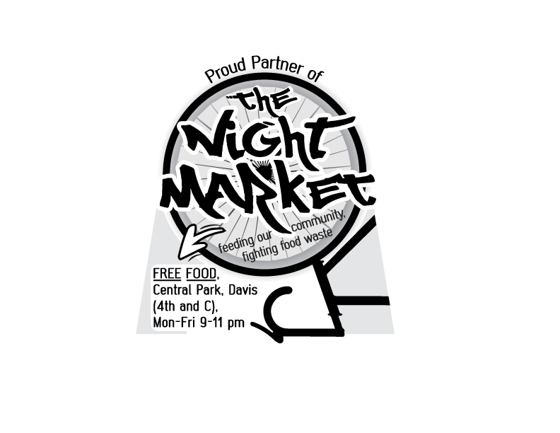
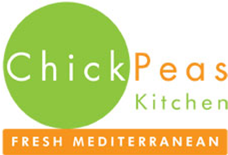
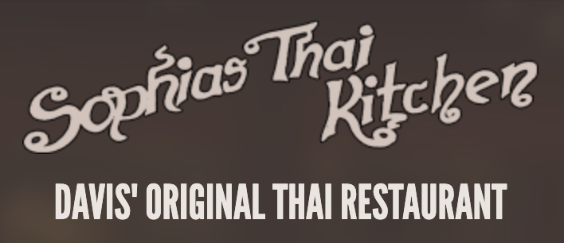
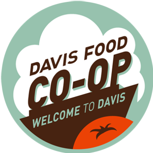
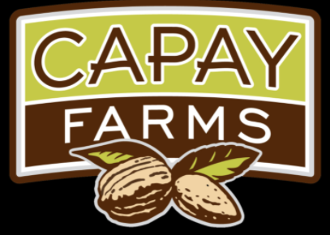
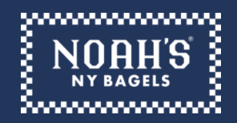
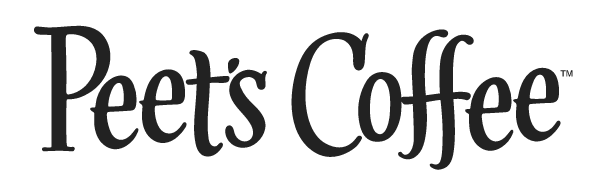

#### The Night Market is an environmentally sustainable community-based **food recovery organization**. 

#### We recover both cooked and non-perishable excess food, and redistribute to the community, no questions asked. 

#### We distribute food every **MONDAY-FRIDAY 9-11PM @ CENTRAL PARK (4th and C) in DAVIS, CA**. Come find us!!

</h4>

</h4>

# WHAT WE'RE ABOUT

Our mission is to reduce our community's carbon footprint and increase equitable access to food through organized collective action. The Night Market strives for a non-hierarchical, anti-racist operating structure steeped in the ideals of radical inclusivity, climate change awareness, and dance parties :)

Our broader mission is to empower other communities to start their own local food recovery systems. Here we provide guidelines and tutorials that can walk you through the steps of establishing our system in other cities (check out the DIY tab!!) Some of these resources are already available on the [Freedge Yourself webpage](https://freedge.org/freedge-yourself/).

# DONORS

#### Look for this sticker on windows in town to know a business is our partner! 

</h4>

</h4>

#### Meet the amazing businesses that are contributing to their community in Davis, CA. Thank you all!!

 
 

      

 

      
      

 
 

      

 

      

 

      

      
 

      

 

      

 

      

# DONATE

## become a donor!!
email us at 
<a href = "mailto: nightmarket@freedge.org"> nightmarket@freedge.org</a> and we'll get back to you ASAP!!!!!!

## pay us money!

[GoFundMe](https://www.gofundme.com/f/davis-night-market-fund)

<form action="https://www.paypal.com/donate" method="post" target="_top">
<input type="hidden" name="hosted_button_id" value="8SMBVXH9MHNQ2" />
<input type="image" src="https://www.paypalobjects.com/en_US/i/btn/btn_donate_LG.gif" border="0" name="submit" title="PayPal - The safer, easier way to pay online!" alt="Donate with PayPal button" />

</form>

# VOLUNTEER 

email us at 
<a href = "mailto: nightmarket@freedge.org"> nightmarket@freedge.org</a> or come visit us the night market (M-F 9-11pm) and chat with us!! We're nice, we promise :)  

</h4>

</h4>

