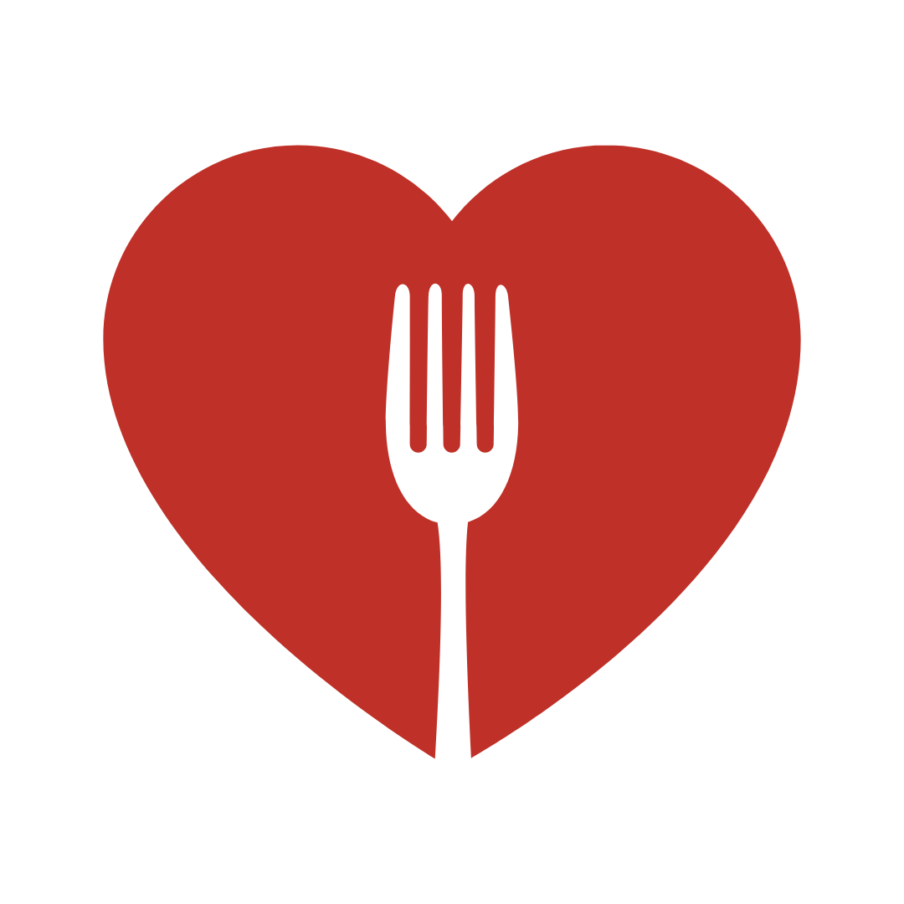

</h4>

# **MISSION**

The Night Market is a community-based, environmentally-sustainable food recovery organization that recovers and redistributes cooked and non-perishable food that would otherwise go to waste in a stigma-free environment. The Night Market's mission is to reduce a community's carbon footprint and increase equitable access to food through organized collective action. We strive for a non-hierarchical, anti-racist, mutual aid operating structure steeped in the ideals of radical inclusivity, climate change awareness, and dance parties :) We aim to ignite a movement of sustainable, inclusive food waste recovery and redistribution that can be replicated anywhere, empowering people and building community in the process. 

# **CORE VALUES**

### Environmental sustainability
We commit to disengage from practices that harm our communities and our planet in order to work toward a healthier future for all. We aim to move all food without the use of fossil fuels. 

### Inclusivity

We do not discriminate based on age, race, color, gender, gender expression, sexuality, ability, housing, or economic status. We do not require proof of need to receive food. 

### Equity and justice

We promote food justice, environmental justice, racial justice, social justice, and all other non-violent justices to dismantle oppressive forces that drive inequity. 

### Community and collaboration

We integrate our organization and its activities with other individuals, entities and agencies focused on mutual aid in our community. We share our knowledge and food freely. 

### Learning and humility

We keep our minds and hearts open to engage in a constant learning/unlearning process to better take care of each other and our community.

### Working with joy

> “All of our work for change can be rooted in the comfort and joy of being connected to one another, accompanying one another, and inspired by each other.” 

(paraphrased from Mutual Aid, Dean Spade 2020)

# **GOALS**

### Decrease food waste

Operating at a hyper-local scale, we are able to recover and quickly redistribute nutritious food that might be beneath the quantity threshold for larger organizations.

### Increase stigma-free food access

In contrast to other food recovery organizations, we do not require proof of need for community members to receive food donations, thus reducing social stigma and barriers associated with food access. The goal is to encourage people to view collecting excess food as a positive experience and to reduce the stigma around food insecurity, all while dramatically increasing access.

### Promote environmental sustainability

The food recoveries we perform are as sustainable as possible. We use bike carts for transporting food and compostable waxed carton boxes for packaging. In this way, we also bring environmental awareness to the issues associated with food waste and transportation.

### Build and empower community

We create a space, curated with lights and music to provide a safe and inviting environment where community members can come together over food, and provide a framework to engage in mutual aid and support each other outside of the system. In this spirit we engage and support other similarly aligned organizations and actions in our community.

### Bring awareness of food waste, food access and insecurity, and sustainability

Creating awareness about the issue of food waste in the context of food insecurity and climate change, and proving that another way is possible is an important part of our ethos. Our bike carts and redistribution events are lighted with LEDs, thus giving visibility to the amounts of food waste and bringing attention to our net-zero choice of transportation. 

### Create a community-based food waste recovery and redistribution that can be replicated anywhere

The overarching aim of our organization is to ignite a movement of environmentally sustainable and inclusive food waste recovery and redistribution that can be replicated anywhere, empowering communities to close the gap between food waste and food insecurity.

**Replicate this in your community!!**

Check out our DIY section to learn how to get started with Night Market in your own community :) 

