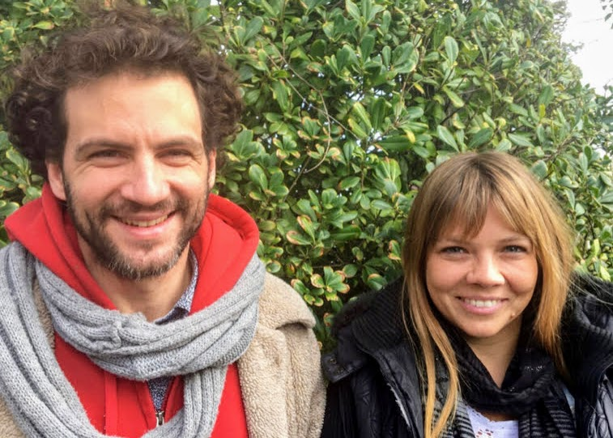

### Val and Ernst


```{css, echo= FALSE}
.avatar{
  border-radius: 50%;
}
```

### Sai
<div>

```{css, echo= FALSE}
.avatar{
  border-radius: 50%;
}
```

### Sabrina
<div>

```{css, echo= FALSE}
.avatar{
  border-radius: 50%;
}
```

### Ania 
<div>

```{css, echo= FALSE}
.avatar{
  border-radius: 50%;
}
```


### Max
<div>

```{css, echo= FALSE}
.avatar{
  border-radius: 50%;
}
```

### Ukelele Joe
<div>

```{css, echo= FALSE}
.avatar{
  border-radius: 50%;
}
```

### Ri
<div>

```{css, echo= FALSE}
.avatar{
  border-radius: 50%;
}
```

